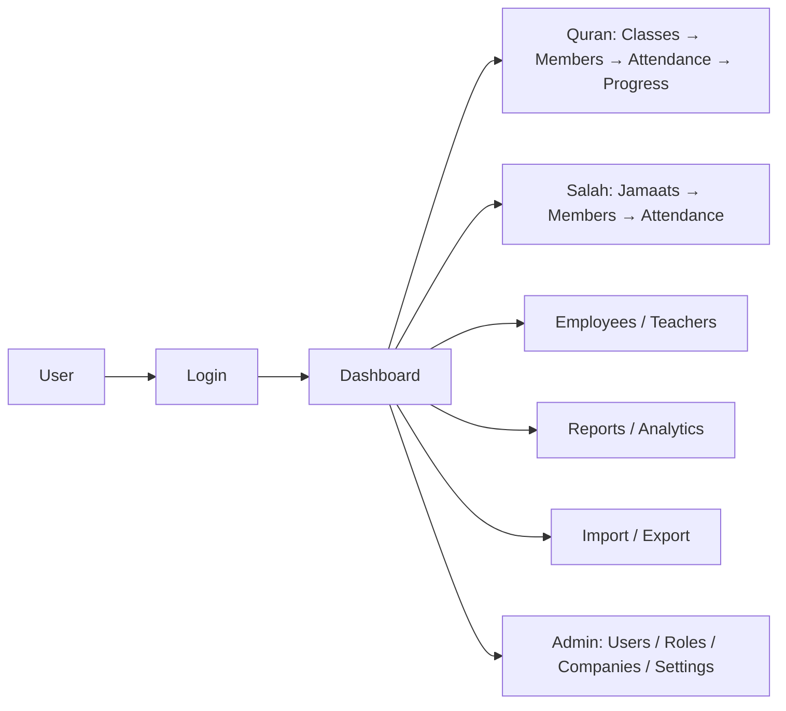

# RAMS — Master Index

**This is the entry point.** If you are a developer, QA engineer, project manager, or AI agent joining this project, start here.

> Status: this index and everything under `docs/project-workflow/` was built by auditing the **actual running code** (migrations, models, routes, controllers, services, policies, config, tests) on **2026-08-19**, not by trusting prior documentation. Where the pre-existing `docs/` files (the numbered `00_`–`50_` specs and the 12 ADRs) disagreed with the code, the code won, and the discrepancy is called out explicitly in the relevant file. See [15-KNOWN-ISSUES.md](15-KNOWN-ISSUES.md) §"Documentation debt" for the full list of resolved contradictions.

## What is RAMS?

RAMS (Religious Affairs Management System) is a multi-tenant SaaS platform, built on Laravel 12, that lets religious organizations (masjids/madrasas/Islamic centers) manage two core departments per tenant company:

- **Quran Department** — teachers, classes, class rosters, daily attendance, and per-student learning-progress tracking.
- **Salah Department** — Jamaats (prayer groups), leaders/vice-leaders, and five-daily-prayer attendance.

Around these two departments sits a full administrative shell: multi-company (tenant) management, employee/HR records, role-based access control, a generic Import/Export engine, an analytics/reporting engine, notifications, and audit logging. See [01-PROJECT-OVERVIEW.md](01-PROJECT-OVERVIEW.md) for the full picture, including who uses it and what's explicitly out of scope.

## How this documentation is structured

| # | File | What's in it |
|---|---|---|
| 00 | [00-MASTER-INDEX.md](00-MASTER-INDEX.md) | This file |
| 01 | [01-PROJECT-OVERVIEW.md](01-PROJECT-OVERVIEW.md) | Purpose, users, roles, in/out of scope |
| 02 | [02-ARCHITECTURE.md](02-ARCHITECTURE.md) | Tech stack, layered architecture, request lifecycle, ADR index |
| 03 | [03-MODULES.md](03-MODULES.md) | Every functional module: routes, controllers, services, models, permissions |
| 04 | [04-DATABASE.md](04-DATABASE.md) | Every table, every model, relationships, company-isolation mechanism, dangerous relationships |
| 05 | [05-BUSINESS-RULES.md](05-BUSINESS-RULES.md) | Extracted "when X happens, Y must happen" rules from the service layer |
| 06 | [06-USER-WORKFLOWS.md](06-USER-WORKFLOWS.md) | End-to-end flows: login, mark attendance, import data, impersonate, etc. |
| 07 | [07-API.md](07-API.md) | Every web route and every `/api/v1/*` endpoint, with auth/permission per route |
| 08 | [08-ROLES-PERMISSIONS.md](08-ROLES-PERMISSIONS.md) | The 10 roles, all 127 permissions, and how enforcement actually works |
| 09 | [09-INTEGRATIONS.md](09-INTEGRATIONS.md) | Third-party packages actually wired in (and which config is an unused placeholder) |
| 10 | [10-ENVIRONMENT-CONFIG.md](10-ENVIRONMENT-CONFIG.md) | Every env var, grouped, with purpose and sensitivity |
| 11 | [11-DEPLOYMENT.md](11-DEPLOYMENT.md) | The two real deploy mechanisms (`pull.php`, `deploy.php`), Docker, rollback |
| 12 | [12-TESTING.md](12-TESTING.md) | Test suite inventory, how to run tests, coverage gaps |
| 13 | [13-SECURITY.md](13-SECURITY.md) | Auth, tenant isolation, CSRF/session, known-secure vs needs-review |
| 14 | [14-PERFORMANCE.md](14-PERFORMANCE.md) | Caching, queues, sync-heavy operations, N+1 risk areas |
| 15 | [15-KNOWN-ISSUES.md](15-KNOWN-ISSUES.md) | Structured issue list, including resolved documentation contradictions |
| 16 | [16-TECHNICAL-DEBT.md](16-TECHNICAL-DEBT.md) | Dead code, architecture deviations, unfinished features |
| 17 | [17-CHANGELOG.md](17-CHANGELOG.md) | Living changelog for changes made *after* this documentation baseline |
| 18 | [18-AI-DEVELOPER-GUIDE.md](18-AI-DEVELOPER-GUIDE.md) | Rules for any future AI agent working in this repo |

Existing documents outside this folder that remain relevant:
- `docs/ADR/ADR-0001` through `ADR-0012`, plus **[ADR-0013](../ADR/ADR-0013-full-page-rtl-for-urdu-locale.md)** (added in this audit) — architectural decision records. Treat ADR-0009 as **superseded** by ADR-0013 (see [02-ARCHITECTURE.md](02-ARCHITECTURE.md#adr-index)).
- `docs/features/*/README.md` — feature-specific notes for Analytics, Attendance Reasons, Import/Export, Membership, Platform, Responsive, Teacher Attendance Tracking. These were written alongside their features and are more trustworthy than the numbered specs.
- Everything else under `docs/` (the numbered `00_`–`50_` specs, the 2026-08-04 "final audit" cluster, `PROJECT_VERSION.md`, etc.) is a **pre-implementation design brief and historical record**, not a description of the current system. Do not cite it as current fact — cite this folder instead. It is kept for historical/planning context only.

## Quick facts (code-verified, 2026-08-19)

| Metric | Count | Source |
|---|---|---|
| Migrations | 47 | `database/migrations/` |
| Database tables | 34 | `Schema::create` calls across migrations |
| Eloquent models | 28 | `app/Models/*.php` (+ 5 shared traits in `app/Models/Concerns/`) |
| Controllers | 43 | `app/Http/Controllers/**` |
| Services | 37 | `app/Services/**` |
| Repositories | 18 | `app/Repositories/**` |
| Policies | 20 | `app/Policies/*.php` |
| Form Requests | 40 | `app/Http/Requests/**` |
| Registered routes | 216 | `php artisan route:list` |
| Permissions | 127 | `database/seeders/PermissionSeeder.php` |
| Roles | 10 | `database/seeders/RoleSeeder.php` (Super Admin + 9 tenant roles) |
| PHPUnit tests | 67 files (54 Feature + 13 Unit) | `tests/Feature`, `tests/Unit` |
| Playwright E2E specs | 11 | `tests/Playwright/*.spec.ts` |

## Main workflows at a glance

See [06-USER-WORKFLOWS.md](06-USER-WORKFLOWS.md) for each flow traced route → middleware → controller → service → database → response.

## How future developers/AI agents should use this documentation

1. Read this file first.
2. Identify which module your task touches — check [03-MODULES.md](03-MODULES.md).
3. Read the relevant workflow in [06-USER-WORKFLOWS.md](06-USER-WORKFLOWS.md) and business rules in [05-BUSINESS-RULES.md](05-BUSINESS-RULES.md).
4. Open the actual code at the file:line references given — this documentation points at code, it doesn't replace reading it.
5. Check [15-KNOWN-ISSUES.md](15-KNOWN-ISSUES.md) and [16-TECHNICAL-DEBT.md](16-TECHNICAL-DEBT.md) before assuming something is a bug — it may already be known and deliberately deferred.
6. After making a change, update the affected file(s) in this folder and add an entry to [17-CHANGELOG.md](17-CHANGELOG.md). See [18-AI-DEVELOPER-GUIDE.md](18-AI-DEVELOPER-GUIDE.md) for the full protocol — this is not optional, per project CLAUDE.md.

## Baseline scope note

This documentation describes `main` at commit `7aba160` (2026-08-19). Since that baseline, PRs #20
through #25 have all **merged into `main`** and are **not yet reflected** in this folder:
- **PR #20** (`feat/jamaat-taleem-tracking`) and **PR #22** (`feat/searchable-employee-select`) —
  update [02-ARCHITECTURE.md](02-ARCHITECTURE.md) (tech stack table, Tom Select),
  [16-TECHNICAL-DEBT.md](16-TECHNICAL-DEBT.md) (Tom Select currently listed as absent),
  [03-MODULES.md](03-MODULES.md) (Salah Module — Taleem tracking) and
  [04-DATABASE.md](04-DATABASE.md) (`jamaat_taleem` table).
- **PR #23** (attendance-reasons Salah/Quran split), **PR #24** (Taleem status on the attendance
  history listing) and **PR #25** (compiled-asset rebuild fix) — see
  `docs/features/attendance-reasons/README.md` for the full design; update
  [03-MODULES.md](03-MODULES.md) and [04-DATABASE.md](04-DATABASE.md) for the `attendance_reasons.type`
  column and its migrations.
- **Branch `feat/taleem-reason-type-and-tabbed-reasons-page`** (not yet a PR at time of writing) —
  adds a third `AttendanceReasonType::Taleem` case (the Taleem "not held" reason no longer borrows the
  Salah list) and **consolidates** the master-data screen from two dedicated pages down to **one
  tabbed page** at `masters.attendance-reasons.{type}` — `masters.salah-attendance-reasons.*` and
  `masters.quran-attendance-reasons.*` (added by PR #23) no longer exist; both single-type controllers
  were replaced by one `AttendanceReasonController` parameterised by an enum route segment. Once
  merged, update [03-MODULES.md](03-MODULES.md) and [04-DATABASE.md](04-DATABASE.md) again.

Check `gh pr list --state open` at the start of any future documentation-maintenance pass to catch new branches like these before they merge silently out of sync with this folder.

## What could not be fully verified in this audit

- **Which deployment mechanism is actually live in production** (`public/pull.php` manual-trigger vs. `public/deploy.php` GitHub webhook) — both are fully implemented and functional in code; only the live server's GitHub webhook configuration (outside this repo) can settle it definitively. See [11-DEPLOYMENT.md](11-DEPLOYMENT.md). Project memory and `.env.example`'s `DEPLOY_PULL_TOKEN` comment both point to `pull.php` being the real one.
- **The real `.env` values for `SESSION_SECURE_COOKIE`, `DEPLOY_*_QUEUE` env vars, and whether Horizon's supervisors are actually configured to listen on the `imports`/`exports` queue names** — this audit read `.env.example` and `config/*.php` defaults only, not the live production `.env` (out of scope for a code audit; see [13-SECURITY.md](13-SECURITY.md) and [14-PERFORMANCE.md](14-PERFORMANCE.md)).
- **A full grep of every `app/Services/**` and `app/Repositories/**` file for raw `DB::table()`/`DB::raw()` calls that might bypass the tenant-isolation Eloquent scope** — the Data Transfer engine was explicitly checked and is clean; a codebase-wide sweep was not exhaustive. Flagged in [13-SECURITY.md](13-SECURITY.md).
- **Whether the live production database's actual role/permission rows match the seeder** (e.g. two migrations — `2026_08_04_130001` and `2026_08_06_100002` — grant permissions to *existing* tenant roles directly via `DB::table()`, bypassing `RoleSeeder`, because re-running the seeder's `syncPermissions()` against a live tenant would blow away any manual role customization). See [04-DATABASE.md](04-DATABASE.md) §Migration Dependency Issues.

Documentation is designed to be maintained as a **living system** — see [18-AI-DEVELOPER-GUIDE.md](18-AI-DEVELOPER-GUIDE.md) rule 22 (project CLAUDE.md). It must be updated whenever the code it describes changes.
